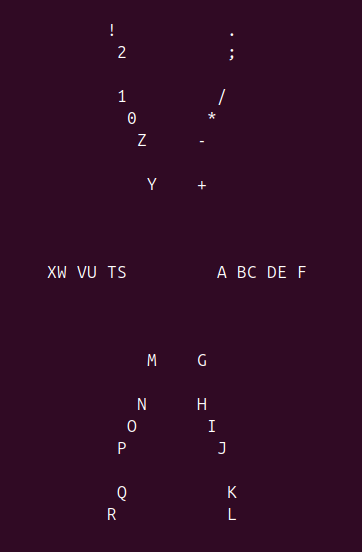
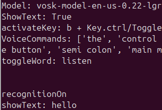

controller- controller to keyboard+ mouse also able to edit it tested on ubuntu x11 debian x11

microphone- voice to text able to make voice commands Tested on ubuntu x11 debian x11

Voice recognition runs on vosk which can be downloaded at setup

controller

microphone

