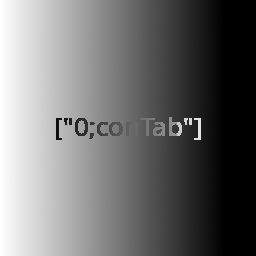

controller- controller to keyboard+ mouse also able to edit it tested on ubuntu x11 debian x11

microphone- voice to text able to make voice commands tested on ubuntu x11 debian x11

controller:

=======
controller- controller to keyboard+ mouse also able to edit it
tested on ubuntu x11 debian x11

microphone- voice to text able to make voice commands
tested on ubuntu x11 debian x11

